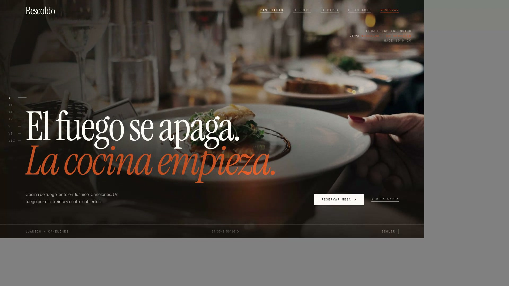

# Rescoldo — Website concept & development

Sitio conceptual para un restaurante ficticio de cocina de fuego lento en
Juanicó, Canelones, Uruguay. Diseño y desarrollo propios, de cero.

> **El fuego se apaga. La cocina empieza.**



## El concepto

Un solo fuego, encendido a las once de la mañana con sarmientos de las viñas
de Canelones, sin volver a alimentarse. Todo el servicio de la noche se cocina con
el calor residual bajo la ceniza. No hay gas en la cocina. Esa restricción
decide todo lo demás: treinta y cuatro cubiertos, los horarios, la carta y por
qué cierran los lunes.

La web está construida como **siete capítulos numerados** que alternan claro y
oscuro para darle ritmo al scroll:

| # | Capítulo | Fondo |
|---|---|---|
| — | Hero | oscuro |
| I | Manifiesto | claro |
| II | El fuego | oscuro |
| III | Los platos | oscuro |
| IV | La carta | claro |
| V | El espacio | oscuro |
| VI | Reservas | claro |
| VII | Cómo llegar + footer | oscuro |

## Decisiones de diseño que vale la pena señalar

- **Base clara, no oscura.** Lo obvio para un restaurante de fuego era un sitio
  todo negro. El negro acá es un recurso dramático que aparece en tres momentos,
  no el default: ese contraste es lo que le da ritmo al recorrido.
- **El fuego está programado, no fotografiado.** Ninguna foto de llamas evitaba
  parecer banco de imágenes, y además contradecía la frase de marca. El capítulo
  II usa un campo de brasas dibujado en canvas (`CampoDeBrasas`): pesa menos de
  3 kB y no se parece a nada.
- **Velos direccionales en el hero.** Un degradado parejo tapaba la foto entera;
  el velo cierra el lado del titular y deja respirar el del sujeto. En mobile el
  velo útil es vertical, no lateral.
- **Precios sin símbolo de moneda.** Es la convención de la alta cocina y evita
  que el proyecto quede desactualizado por la variación cambiaria.
- **Un solo revelado fotográfico.** Todas las fotos pasan por el mismo
  tratamiento en CSS (`.photo`): contraste alto, saturación baja, temperatura
  cálida y sombras cerradas. Es lo que hace que fotos de origen distinto
  parezcan del mismo fotógrafo.
- **Mobile no es el desktop reducido.** El scroll horizontal atado al scroll
  vertical de «Los platos» se siente mal con el dedo, así que en touch es un
  carrusel con snap. Los horarios son pastillas grandes y no un `<select>`. Hay
  una barra inferior fija con la única acción que importa en un celular.

## Stack

- React 19 + TypeScript
- Vite
- Tailwind CSS v4 (tokens en `src/index.css`)
- [Motion](https://motion.dev) para las animaciones
- [Lenis](https://lenis.darkroom.engineering) para el scroll suave
- Tipografías self-hosted: Instrument Serif, Instrument Sans, DM Mono

Sin peticiones a terceros: fuentes e imágenes se sirven desde el propio sitio.

## Correr el proyecto

```bash
npm install
npm run dev
```

```bash
npm run build
```

## Video de presentación

Las piezas de video se graban del sitio real con Chrome + Playwright sobre el
build de producción, así que muestran las animaciones de verdad:

```bash
npx vite preview --port 4180 &
node scripts/reel.mjs desktop    # 1920×1080, portafolio
node scripts/reel.mjs vertical   # 1080×1920, Reels y TikTok
```

La coreografía está escrita como un guion con planos y pausas en
`scripts/reel.mjs`. Las piezas exportadas y las notas de publicación viven en
`marketing/`.

## Estructura

```
src/
  data/        contenido editable: carta, capítulos, contacto, imágenes
  sections/    los siete capítulos
  components/  piezas reutilizables (Figura, Reveal, Nav, CampoDeBrasas…)
  hooks/       scroll suave, capítulo activo, reloj del fuego, contadores
  lib/         sistema de movimiento y utilidades de scroll
  index.css    tokens de color, tipografía, espaciado y tratamiento fotográfico
```

## Reemplazar la fotografía

Todas las imágenes entran por `src/data/images.ts`. Ningún componente conoce
una ruta de imagen: para cambiar el set de referencia por fotos reales alcanza
con reemplazar los archivos en `public/img/` y actualizar los `alt`.

El set actual es material de referencia con una misma dirección fotográfica —
una sola fuente de luz cálida y lateral, sombras cerradas, encuadres cerrados—
y está pensado para ser sustituido.

## Accesibilidad

- `prefers-reduced-motion` desactiva scroll suave, parallax, contadores, el halo
  del cursor y la animación de las brasas.
- Navegación por teclado con foco visible, skip link y estructura semántica.
- El formulario de reservas usa `fieldset`/`legend` y etiquetas reales.

## Nota

Restaurante, marca, carta, dirección y teléfono son ficticios. Las localidades,
la zona vitivinícola y los productos sí son reales. El formulario de
reservas es una demostración y no envía información.

Concepto, diseño y desarrollo — **Dylan Silva**
